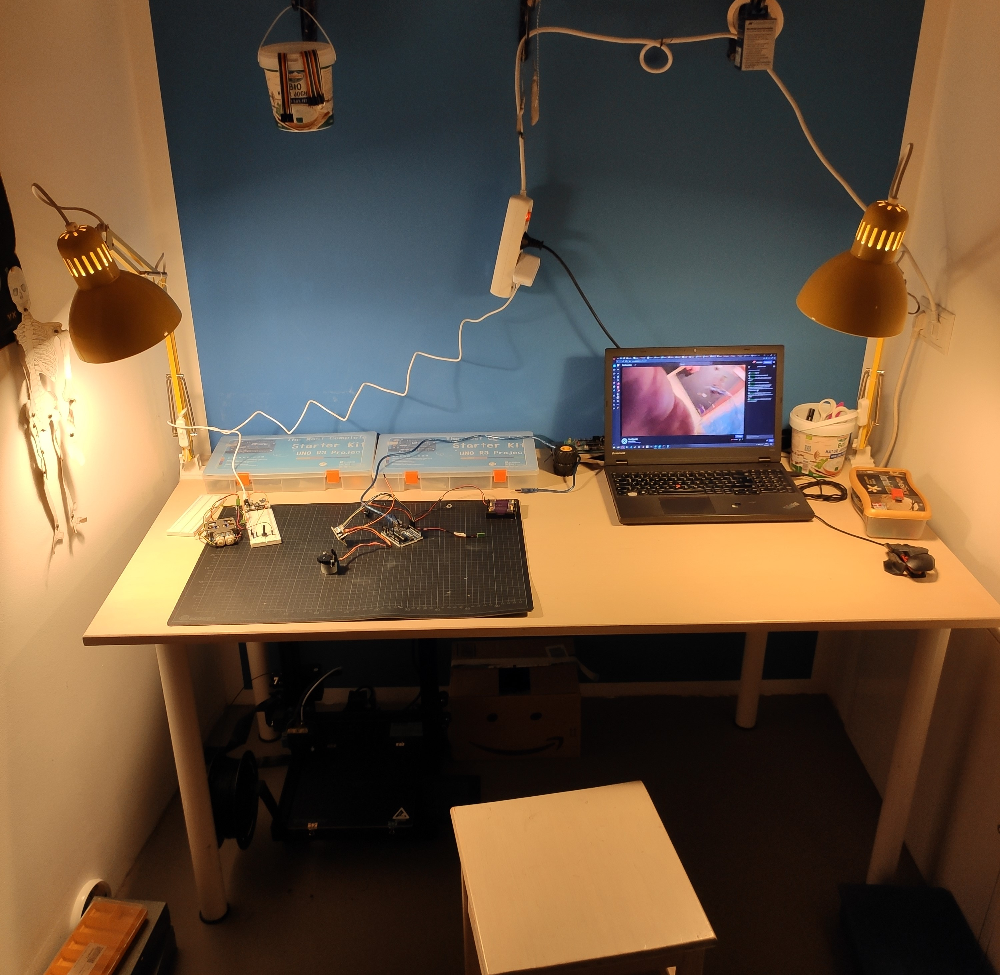

## A small histrory of what happended when

---

### 19.04.2021
#### Installing of required software:
 - node-red
 - EMOTIV BCI
 - node-red-emotiv-toolbox

---

### 21.04.2021
#### Trying to create a connection between node-red and arduino
 - Connunication will happen via USB serial connection
 - Add node-red-nodes-serialport addon for communication to serial ports
 - Add node-red-dashboard for quick UI testing
 - node-red dashboard [here](http://localhost:1880/ui) when node-red is running
 - Serial connection test
    - See `../Arduino/serial_connetion_test` and `../Node-RED/serial_connection_test.json`
    - Serial connection baud rate 9600 on COM3
        - > COM Port is hardware dependend
    - > Only one software can connect to a serial connection at a time. Do not use Arduinos (or any) serial monitor and node-red at the same time
    - The Arduino repeats the message sent from the node-red dashboard

---

### 26.04.2021
#### Rented the headset
 - Frame, two parts
 - Sensors
 - Liquid
 - Wire
 - USB-Stick
 - Serial Number

#### Headset intro
 - Not more than 8 refreshments per second
 - Realistically 1 thought/second
 - Threshold at about 50
 - Smoothing function -> Failsafe against wrong commands
 - 20-30 training sessions
 - Keep sensors slightly moist
 - Store sensors in packaging
 - Virtual headset in EMOTIV app
 - Live training feedback on
 - Learn commands one by one
 - Small trainings sessions

#### Does EMOTIV work with Linux?
- Beta version for Ununtu
- EMOTIV beta might be more of an alpha0

---

### 27.04.2021
#### Headset training
 - Training commands
 - Makes no sense
 - Testing with second Person
 - Similar results on first approach
 - Feel intense thinking in certain area of brain.
    - > Meditation ?
    - Feels weird. Like flexing a muscle, but with parts of the brain
 - Wearing headset, start at base, adjust left three sensors first
 - Bad connection? More lube -> like oil in a pan
 - Bad eeg? Relax. Breath. Muscle movements can impact the eeg

#### Added a idea tag for issues. To mark potential other projet ideas.

---

### 28.04.2021
#### Headset training
 - Issue connecting the headset bluetooth connetion?
    - Reattach hedset usb-dongle
 - This might be not as easy as I thought..

#### Creating sounds
- Virtual oscillators
    - One per command

#### EMOTIV and node-red
- Client secret and id added in `\\Users\$USER$\.node-red\node_modules\node-red-contrib-emotiv-bci\emotiv-bci`
- Command node not conneting

---

### 29.04.2021
#### Command node
 - Command node was not connecting
 - Reinstalled node-red and bci-toolbox
 - Remove and readd command node

---

### 30.04.2021
#### Buzzer
 - A complete connection between the EMOTIV headset and the arduino board
 - Ardunio sketches can not be updated when node-red is accessing the serial port
 - The Arduino reads serial intput in bytes. ~~One byte per loop.~~ Apparently each integer set by node-red, is received as a string. So 55 is two character. This causes a delay when creating the sounds, as reading the string from the serial port takes time. Therefore the numerical value is converted to a single char ([64 becomes `@`](http://www.asciitable.com)), which is then transmited
 - Arduino circuit backups. Which software?
    - > [Tinkercad](https://www.tinkercad.com)
    - Link to circuit can be found at the top of the appropriate arduino sketch
 - The passive buzzer on the Arduino creates a sound of varying pitch, depending on the commands strength

---

### 03.05.2021
#### Return headset
  - Returned to coworker, email confirmation

#### Learning electrical engineering
 - A few basics to make sure, I know how to work with Arduino again

#### 3D Printing
 - Got access to an old 3d printer
 - Might be useful for parts which play an instrument?
 - Probably needs calibration
   - Follow a [guide](https://teachingtechyt.github.io/calibration.html)? 
   - [x] PID Autotune
   - [x] Extruder E-Steps

---

### 04.05.2021
#### Deconstruction of an old Project
 - Deconstructed the fontys car
 - Learned some more things about electronics
 - Citrus acid can clean clean spills of household battery acid. As battery acid is not an acid but alkaline. [See here for more](https://www.energizer.com/about-batteries/what-is-battery-acid).
 - Looking at [this idea](https://github.com/StyxOo/BrainMusic/issues/1), I think it should be quite doable. Maybe one could have races?

---

### 05.05.2021
#### Arduino Serial
 - Arduino can read many bytes per loop.
 - A demo which reads 4 bytes per loop can be found at `../Ardunio/serial_communication_test`
 - > When testing whith a serial monitor: make sure to not send a newline character in the end. Otherwise the first loop will read the desired output. The second loop will read the newline as remaning byte and will output a newline and whichever the last three characters where.
 - The test is set up to receive 4 characters. According to the four command strengths

---

### 06.05.2021
#### Motor tests
 - Connected a motor to an external power source
   - Potentiometer for ontrolling speed
 - Also connected a stepper motor to the arduino
   - [Like this](https://www.tutorialspoint.com/arduino/arduino_stepper_motor.htm)
   - Steps can be controlled via code

---

### 07.05.2021 - 10.05.2021
#### 3D-Printer calibration
 - Required several times of rebuilding firmware as well as many small prints
 - Steps completed:
   - [x] Frame
   - [x] PID Autotune Nozzle
   - [x] PID Autotune Bed
   - [x] Bed leveling
   - [x] Extruder E-Steps
   - [x] Flow calibration
   - [x] Stepper motor driver current
   - [x] Retraction tuning
   - [x] Temperature tuning
   - [x] Acceleration tuning
   - [ ] Linear advance
      - Not possible with the XY-2 Pro Stepper drivers.

---

### 11.05.2021 - 14.05.2021
#### How can I physically play an instrument
 - I have a bass guitar for testing
 - Strings are quite big and easily accessible
 - How will a mechanism hold?
   - Lego and double sided tape as a base?
 - What will play the strins?
   - An arm?
   - A spinning wheel?
   - How will it take the command strength into account?
 - Using Lego to mock up some ideas

---

### 17.05.2021
#### Meeting
 - Progession on playing instruments
 - If music is completed, have a look at a car project
 - Sensor liquid is now available
   - Can the bottle be refilled?

---

### 18.05.2021
#### 3d Modelling
 - Which software?
   - > [FreeCAD](https://www.freecadweb.org)
 - Getting familiar with the software
 - Trying to model a basic lego block
   - Can be found in `../Models/freeCAD/Block.FCStd`
 - Models are organized in the `../Models` directory
   - `../Models/freeCAD` contains freecad files
   - `../Models/stl` contains the stl files which are used in the Cura slicer for 3D printing

---

### 19.05.2021
#### Connecting hardware with lego
 - How can the existing hardware, motors etc, be connected with lego pieces?
 - Thining about ways to connect the stepper motor
   - Attachment for the stepper motor in `../Models/freeCAD/Stepper_Motor_Connector.FCStd`
   - > Probably need caliphers for more precise measurements
   - Iterating connection design
     - > Measurements are not printed exact by the printer. needs some trial and error to dial in...

---

### 20.05.2021
#### Picking up headset
 - Complete contents as listed in the earlier checklist
 - Liquid bottle can not be easily refilled
   - > Might be possible with a syringe?

#### Mental commands training
 - First commands is always triggered. Trained it too much?

---

### 22.05.2021 - 28.05.2021
#### Set up a proper workspace
 - 

#### Media for documentation
 - All videos and images can be found in the `./Media` directory
 - Some might be not directly used in the documentation. Fell free to snoop around

#### Building hardware
 - The process of creating the hardware is much more tedious than expected.
 - Implementing the electrical motors with lego took more time and attempts than expected
 - The first idea was to print an attachment to a lego axle 
   - Does not work. The axle is not printed exact enough. Furthermore the attachment hole does not have proper dimensions.
 - Trying to dial in the motor attachment dimensions 
 - Connect a lego fitting gear to the motor?
   - Design gear in FreeCAD 
   - Printing 
   - Check fit 
   - Rinse and repeat until it fits 
 - The engine needs to be attached to lego pieces
   - Some kind of mount to lego space is needed.
   - Back to FreeCAD 
   - How the it works with a gear attached 
 - [It works!!](https://youtu.be/11dx0H1Ohlk)
 - The actual finger is build from lego
  - Allows fast prototyping and iteration
  - [First results seemed promising](https://youtu.be/SAyn8TfC4LA)
  - Some issues with not releasing the string fast enough to create a sound. If the finger pulls stronger, the motor does not provide enough power and gets stuck.
  - [A second motor is added](https://youtu.be/E1cup7A4TuQ)
   - Issues with string release and lack in strength persists
 - Change how motor power is used
   - [Can be seen here](https://youtu.be/ROO-vfrWCQ4)
   - The motor tensions a spring
   - The spring releases a hammer

---

### 31.05.2021 - 27.06.2021
#### Finalizing Hardware
 - Experimented with the number of drops on the driving wheel. Two works, three is too much. The angle becomes too steep.
 - Set up the concept of the second prototype around the bass. And it is able to make the first sounds! [Can be seen here](https://youtu.be/QirRiCVQM7E)
 - Trying to resolve isues with stepper motor power
   - Repinned an adjustable power supply
     - he driver board is rated for 5-12V, the motor for 5V
     - More power makes steps more pronounced
     - Also heats up motor
     - No improvements -> Probably not a power issue
   - Apparently a signal timing issue caused irregulatities
 - Current prototype will not fit on base four times
 - Oriented lenght ways along bass
 - Created a longer driver wheel to move all hammers
 - Proof of concept for one hammer 
   - Relies on rubbers to pull down towards the string, instead fo a big convuluted lego construction
 - All hammers attached to bass 
 - Sound intensity controlled by servos mounted above
   - Connected to the top of the hammers with a rubber as well
   - Pulling against the rubber below, the intensity can be dialed in
   - Hard to hear on video, but [here it is](https://youtu.be/KiKZ2MzRZEQ)
   - Also adjusted the bass strings height to work for all hammers
  
#### Interface to configure servos
 - The servos controlling the level of sound need to be set up individually. Because each rubber has different proberties, different angles lead to different results
 - Considered setting up servoes through node-red or directly on arduino
   - The servos themselfes do not really have anything to do with node-red, so I decided to do it on the arduino itself
 - Wire up a screen and a few buttons to be able to change settings
   - Troubleshooting weird icons on lcd screen [as seen here](https://youtu.be/Rxcgkt5q_3U)
   - Screen can not be powered from the external power supply. Needs the wavelength as provided by the arduino
 - Clean up wireing
   - 
   - 
 - Attached Electronics to bass. I decided to use hot glue. It acts as an isolator on the electronics, does not damapge the bass, can be easily removed, but also still holds. 
 - Interface code can be found in `../Arduino/servo_interface`
